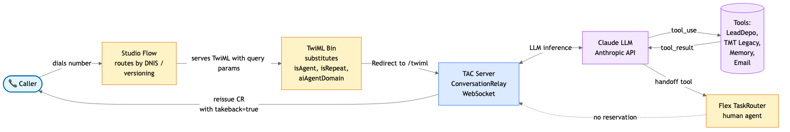
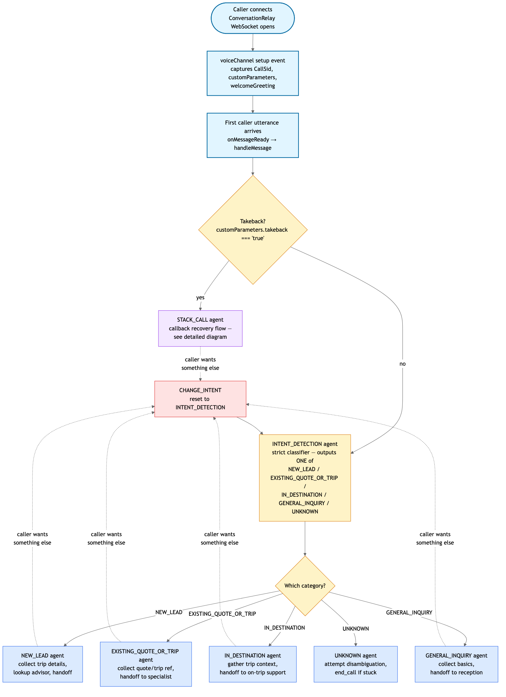
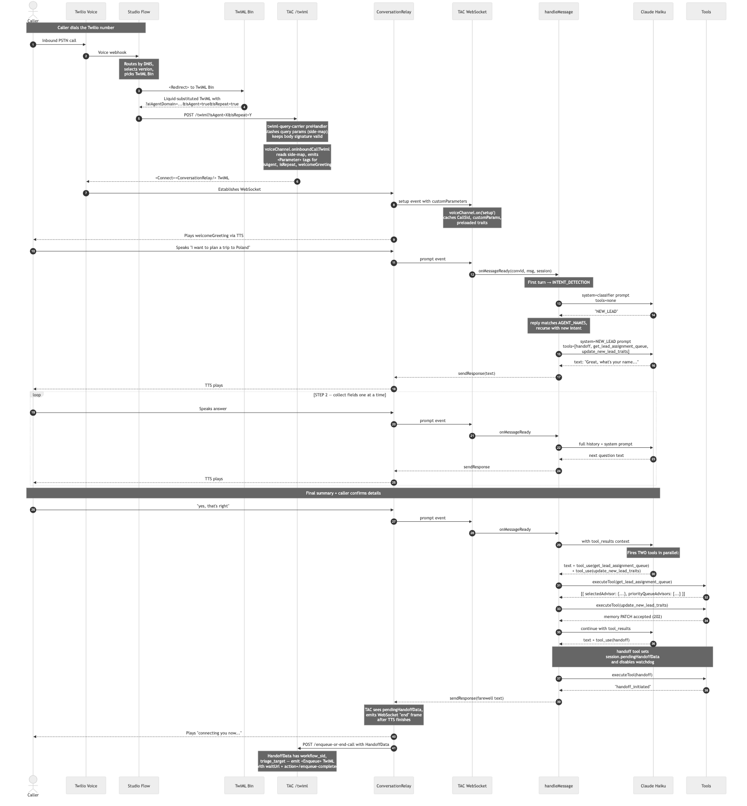
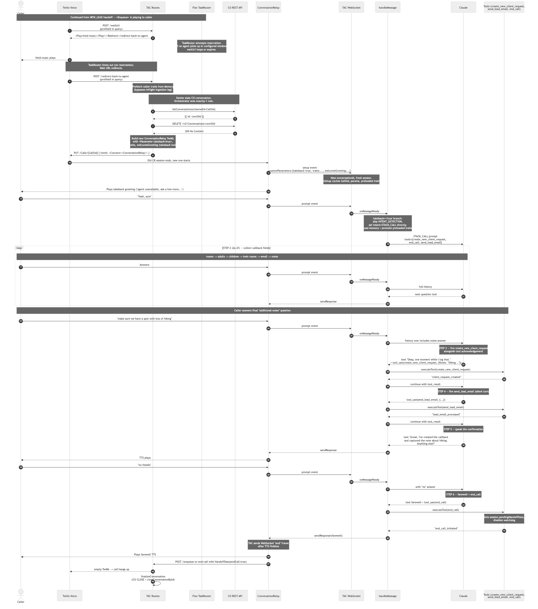

# Kensington Tours — AI Voice Concierge

A TypeScript / Node.js application built on [Twilio Agent Connect (TAC)](https://www.twilio.com/docs/platform/tac/overview) and Anthropic's Claude that answers inbound voice calls for Kensington Tours. The AI qualifies the caller's intent, collects the information a live specialist needs, and either:

- **routes the caller to the right destination expert** (NEW_LEAD flow), or
- **records a callback and hangs up cleanly** (STACK_CALL flow, when no specialist is available).

The system is designed for zero human intervention on the happy path and graceful recovery when a specialist can't be reached or when Claude itself is unavailable.

---

## Table of contents

- [High-level architecture](#high-level-architecture)
- [Repository layout](#repository-layout)
  - [`src/index.ts`](#srcindexts)
  - [`src/logger.ts`](#srcloggerts)
  - [`src/watchdog.ts`](#srcwatchdogts)
  - [`src/agents/`](#srcagents)
  - [`src/tools/`](#srctools)
  - [`src/additional-routes/`](#srcadditional-routes)
  - [`src/cache/`](#srccache)
  - [`src/stubs/`](#srcstubs)
  - [`scripts/`](#scripts)
  - [`functions/`](#functions)
  - [`patches/`](#patches)
- [Flow diagrams](#flow-diagrams)
- [Prerequisites](#prerequisites)
- [Setup](#setup)
- [Running](#running)
- [Logging](#logging)
- [License](#license)

---

## High-level architecture



- **Studio Flow** — Twilio's Studio orchestrates inbound-call routing per DNIS and version. It's the first thing the caller's dial hits and decides which TwiML Bin to serve.
- **TwiML Bin** — a small Liquid-templated TwiML resource that redirects to this app's `/twiml` endpoint with query parameters (`aiAgentDomain`, `isAgent`, `isRepeat`). One Bin can serve many DNIS numbers with different metadata.
- **TAC server (`src/index.ts`)** — a Fastify app that hosts TAC's ConversationRelay WebSocket, `/twiml` webhook, and our custom lifecycle routes. Owns the shared pino logger and boots the watchdog + backends.
- **Claude** — Anthropic's Haiku 4.5 (default) handles turn-by-turn conversation. Each intent has its own system prompt and tool set.
- **Tools** — a small set of side-effect functions Claude can invoke: destination-expert routing, memory writes, callback creation, transactional email, human handoff.
- **Flex TaskRouter** — the destination-expert routing target. When a NEW_LEAD is complete, `handoff` enqueues the caller here. If no agent picks up within the wait window, the call is redirected back into a fresh CR session (STACK_CALL) so the caller can leave a callback request.

---

## Repository layout

```
├── docs/
│   └── diagrams/                 ← Mermaid sources + rendered PNGs
├── functions/                    ← standalone Twilio Serverless functions
├── patches/                      ← patch-package fix for twilio-agent-connect@2.3.0
├── scripts/                      ← dev tooling (log-table, smoke tests)
├── src/
│   ├── index.ts                  ← server entry point + all event wiring
│   ├── logger.ts                 ← shared pino logger + ALS session context
│   ├── watchdog.ts               ← 3-stage silence-timer state machine
│   ├── agents/
│   │   ├── index.ts              ← handleMessage() — the main LLM loop
│   │   └── prompts.ts            ← all system prompts, one per intent
│   ├── tools/                    ← everything the LLM can invoke
│   │   ├── index.ts              ← tool registry (name → executor)
│   │   ├── handoff.ts            ← TaskRouter enqueue with routing attrs
│   │   ├── end-call.ts           ← hang up the current call
│   │   ├── lead-queue.ts         ← LeadDepo API (advisor routing)
│   │   ├── tmt-legacy.ts         ← KT Legacy API (callback records)
│   │   ├── tmt-profile.ts        ← KT Profile API (profile lookups)
│   │   ├── memory-client.ts      ← Twilio Conversation Memory client
│   │   ├── send-email.ts         ← lead-summary email (SendGrid/Twilio)
│   │   └── knowledge-base.ts     ← optional Enterprise Knowledge Base
│   ├── additional-routes/
│   │   ├── enqueue-with-takeback.ts   ← lifecycle HTTP routes
│   │   └── twiml-query-carrier.ts     ← preserve /twiml query params
│   ├── cache/
│   │   └── index.ts              ← per-conversation state + boot priming
│   └── stubs/                    ← canned responses for offline dev
├── .env / .env.example           ← runtime configuration
├── package.json                  ← scripts + deps
└── README.md                     ← this file
```

### `src/index.ts`

**Purpose:** application entry point.

Sets up dotenv (must run first), boots the shared pino logger, creates the TAC instance, wires up `VoiceChannel`, registers all event handlers (`setup`, `interrupt`, `agentSpeaking`, `clientSpeaking`, `onMessageReady`, `onConversationEnded`), builds a Fastify instance with the shared logger, mounts custom routes, and starts the server on port 3000.

Key handlers wired here:

- **`voiceChannel.onInboundCallTwiml`** — emits `<Parameter>` values into the ConversationRelay TwiML so the WS setup event carries `isAgent`, `isRepeat`, and `welcomeGreeting`.
- **`voiceChannel.on('setup')`** — captures CallSid → conversationId mapping and any pending preloaded traits.
- **`voiceChannel.on('interrupt')`** — barge-in bookkeeping: truncates the last assistant history turn to what was actually spoken.
- **`voiceChannel.on('agentSpeaking' | 'clientSpeaking')`** — feeds the silence watchdog. Arms the timer when the agent finishes speaking, cancels it when the caller starts.
- **`tac.onMessageReady`** — the entry point for every customer utterance; delegates to `handleMessage`.
- **`tac.onConversationEnded`** — teardown callback for CO-driven cleanup.

### `src/logger.ts`

**Purpose:** structured logging infrastructure.

- **Shared root pino logger** — used by TAC internals, Fastify request lifecycle, and all our custom code. Pretty-printed in dev, JSON in prod.
- **AsyncLocalStorage session context** — `runInSession(convId, callSid, fn)` opens a per-turn scope. Any log inside that scope (even from deep tool calls) automatically carries `type: 'session'`, `conversationId`, and `callSid`.
- **`serverLog` / `sessionLog(convId?)` / `contextLog()`** — three logger flavors: boot-time server logs, per-turn session logs, and a "which one am I in?" auto-picker.
- **Side-map registries** — `CallSid ↔ conversationId` maps so out-of-scope handlers (HTTP routes, interrupt handler) can resolve identity without threading context.
- **`deepAutoParse`** — recursively parses embedded JSON strings in log payloads so `pino-pretty` renders trees rather than escape-heavy blobs.
- **`isLogEnabled(flag)`** — flag-gated category suppression via `LOG_DISABLED_FLAGS` env var.
- **`ClaudeApiCall` accumulator** — every Claude call in a turn is timed and pushed onto the store; the aggregate is emitted in the `AGENT_RESPONSE` log.

### `src/watchdog.ts`

**Purpose:** three-stage silence escalation for voice calls.

Driven entirely by CR speaker events (`agentSpeaking` / `clientSpeaking` on/off), not by our own message flow. Uses `WATCHDOG_SILENCE_ONE_SECONDS`, `WATCHDOG_SILENCE_TWO_SECONDS`, `WATCHDOG_HANGUP_SECONDS` env vars (default 15s each).

- **SILENCE_ONE** — inject a synthetic `"SILENCE_ONE"` user message; prompt tells Claude to re-ask its last question OR fire the tool it forgot.
- **SILENCE_TWO** — same behavior, escalated.
- **HANGUP_CALL** — bypasses the LLM entirely, speaks a hardcoded farewell via `voiceChannel.sendResponse`, invokes `executeEndCall` on the session.

`disableWatchdog(convId)` is called from terminal-action tools (`handoff`, `end_call`) so the trailing `agentSpeaking:off` (from the farewell TTS) doesn't rearm a fresh timer against a dying session.

### `src/agents/`

**`agents/index.ts`** — the LLM orchestration loop.

- **`handleMessage(tac, params)`** — public entry point. Opens the ALS session scope, emits the `CUSTOMER_INPUT` and aggregate `AGENT_RESPONSE` log.
- **`handleMessageInternal`** — the recursive worker. Selects the current intent's system prompt, calls Claude (with retry + fallback), runs the agentic tool loop, collects text from every turn.
- **`callClaudeWithRetry`** — one-shot retry with 300ms backoff. On double-failure, invokes `fallbackToLiveAgent` which fires the `handoff` tool directly against `HANDOFF_LIVE_ANSWER_WORKFLOW_SID` so the caller doesn't get stranded on a broken bot.
- **`clearConversation(session)` / `clearConversationById(convId, from?)`** — teardown paths. Purge histories, intents, caches, watchdog state, session-context side-maps.

**`agents/prompts.ts`** — every system prompt.

Six intents, each with its own tool set:

| Intent | Purpose | Model | Tools |
|---|---|---|---|
| `INTENT_DETECTION` | Strict single-token classifier | Haiku 4.5 | none |
| `NEW_LEAD` | Collect trip details + route to specialist | Haiku 4.5 | `handoff`, `get_lead_assignment_queue`, `update_new_lead_traits` |
| `EXISTING_QUOTE_OR_TRIP` | Follow-up on quote/booked trip | Haiku 4.5 | `handoff` |
| `IN_DESTINATION` | Support for callers currently traveling | Haiku 4.5 | `handoff` |
| `GENERAL_INQUIRY` | Non-booking-related questions | Haiku 4.5 | `handoff` |
| `STACK_CALL` | Callback recovery when specialist unavailable | Haiku 4.5 | `create_new_client_request`, `send_lead_email`, `end_call` |
| `UNKNOWN` | Attempt disambiguation, otherwise `end_call` | Haiku 4.5 | `end_call` |

`preparePrompt(intent, session, prompt, traitsContext)` layers additional context (call metadata, caller phone, memory traits, LeadDepo catalog) onto the base prompt and appends the `SILENCE_HANDLING_SECTION` for all non-classifier intents.

### `src/tools/`

Each tool is an Anthropic `Tool` definition plus an executor function. All tools are registered via `tools/index.ts` — that's what `executeTool(name, input, tac, ctx, session)` dispatches on.

| Tool | File | What it does |
|---|---|---|
| `handoff` | `handoff.ts` | Enqueues the call into a TaskRouter workflow. Sets `session.pendingHandoffData`, disables the watchdog. TAC emits the WS "end" frame after TTS finishes. |
| `end_call` | `end-call.ts` | Hangs up cleanly after the caller hears a farewell. Same mechanism as `handoff` but the action-URL branch returns empty TwiML instead of `<Enqueue>`. |
| `get_lead_assignment_queue` | `lead-queue.ts` | Calls LeadDepo (Auth0 M2M) to get the ranked advisor queue for a destination × activity × channel. Uses cached reference data primed at boot. |
| `update_new_lead_traits` | `memory-client.ts` | PATCHes Twilio Conversation Memory with the caller's captured NewLead traits. Falls back to phone-lookup if profileId resolution via `retrieveMemory` returns nothing (an inflight-ingestion edge case). |
| `create_new_client_request` | `tmt-legacy.ts` | Creates a callback record in KT's Legacy (Navigatr) API. Used only by STACK_CALL. |
| `send_lead_email` | `send-email.ts` | Emails a "New Lead Summary" to the ops team via either SendGrid or the Twilio Emails API (selected via `EMAIL_PROVIDER` env var). Always returns `lead_email_processed`, regardless of underlying success/failure — errors surface via the `EMAIL_FAILURE` pino log so the LLM never sees a failure string. |
| `search_knowledge_base` | `knowledge-base.ts` | Optional Enterprise Knowledge lookup. Only registered when `TWILIO_KNOWLEDGE_BASE_ID` and `TWILIO_KNOWLEDGE_BASE_PROMPT` are set. |

`tmt-profile.ts` is a client for KT's Profile API but isn't wired to a specific Anthropic tool yet — it exists for future profile-lookup features.

### `src/additional-routes/`

**`enqueue-with-takeback.ts`** — the HTTP routes that make the takeback flow work.

- **`POST /waitUrl`** — served while TaskRouter is waiting for a reservation. Plays hold music, redirects to `/redirect-back-to-agent` after a short window.
- **`POST /redirect-back-to-agent`** — the takeback path. Deletes any stale CO conversation grouped under the CallSid (Orchestrator requires exactly-1 rule), prefetches the caller's NewLead traits, and reissues a fresh `<ConversationRelay>` via `Calls.update` with `takeback=true` as a `<Parameter>`. That flag flips the next `handleMessage` into STACK_CALL directly instead of going through INTENT_DETECTION.
- **`POST /enqueue-or-end-call`** — the `<Connect action>` URL. Receives `HandoffData` when the CR session ends. Three branches:
  - No `HandoffData` → caller hung up → `finalizeConversation` cleanup.
  - `HandoffData.endCall === true` → `end_call` tool triggered → return empty TwiML + cleanup.
  - Real handoff → build `<Enqueue>` TwiML with `waitUrl` + `action=/enqueue-completed`.
- **`POST /enqueue-completed`** — fires when the enqueue verb ends for any reason (bridged/hangup/timeout/error). If `QueueResult !== 'bridged'`, runs `finalizeConversation` so callers hanging up during hold music don't leak CO conversations.

`finalizeConversation` is the shared cleanup helper: it marks the CO conversation `CLOSED` via REST (fires TAC's `onConversationEnded` webhook path) AND calls `clearConversationById` directly (belt-and-braces — the direct path guarantees eviction even if the CO webhook lags or never fires).

**`twiml-query-carrier.ts`** — a Fastify preHandler that mirrors `/twiml` URL query parameters into a CallSid-keyed side-map. Necessary because TAC's `TwiMLRequest.extra` is built from `request.body` only — URL query params are dropped. The naive fix of merging query into body invalidates TAC's Twilio-signature check, so this preHandler works alongside it (body untouched, query preserved via side channel).

### `src/cache/`

**`cache/index.ts`** — process-wide caches and boot-time backend priming.

- **`histories: Map<convId, MessageParam[]>`** — the in-memory conversation history per Claude turn.
- **`memoryCache: Map<convId, TACMemoryResponse>`** — per-conversation Memory API response cache.
- **`traitsCache: Map<convId, string>`** — the formatted NewLead traits string, cached so STACK_CALL doesn't re-fetch on every turn.
- **`intents: IntentMap`** — the current intent per conversation, with a helper that logs transitions.
- **`resolveCallSid / resolveCustomParams`** — resolvers that join pending `voiceChannel.on('setup')` state onto the session.
- **`consumePreloadedTraits(from)`** — one-shot read (with TTL sweep) of takeback-prefetched traits.
- **`purgeConversation`** — teardown sweep for a single conversation's entries.
- **`cacheBackendData()`** — called at startup: primes the LeadDepo bearer token + reference-data caches (destinations, activities, channels), and pre-authenticates the TMT Legacy and TMT Profile services.

### `src/stubs/`

Canned responses for offline dev. Enabled via `USE_API_STUBS=true`. Each backend module (`lead-queue`, `tmt-legacy`, `tmt-profile`) checks `isStubMode()` and returns the corresponding stub data instead of hitting the real API. Useful when the KT backends aren't reachable from your dev environment.

`LOG_API_RESPONSES=true` (combined with `USE_API_STUBS=false`) writes each real API response to a timestamped file under `logs/<api>_log/` for later inspection. To promote a recorded response into a canned stub, copy the desired JSON file into the corresponding `src/stubs/*.ts` module.

### `scripts/`

- **`dev-table.sh`** — pipes `dev` server logs through `jq | awk` to produce a compact colorized table view. See [Logging](#logging).
- **`test-send-email.ts`** — smoke test for `send_lead_email`. Run with `npx tsx scripts/test-send-email.ts`.

### `functions/`

- **`find-available-worker.js`** — a Twilio Serverless function that looks up a Flex TaskRouter Worker by email attribute and reports whether they're currently in an "available" activity. Used from Studio Flow to decide whether to route the call to AI or a human. Requires `TASKROUTER_WORKSPACE_SID` set as an env var on the Serverless service.

### `patches/`

`patch-package` fix for `twilio-agent-connect@2.3.0`. Applied automatically by the `postinstall` script. Contains two changes to the SDK:

1. Unwraps ConversationRelay's `speakerEvents` envelope format (`{type: "info", name: "agentSpeaking", value: "on"}` → `{type: "agentSpeaking", value: "on"}`) before Zod validation, so TAC dispatches the events correctly.
2. Adds `raw_message` to the SDK's rejected-message debug log so future wire-format drift is diagnosable.

---

## Flow diagrams

Four diagrams at increasing detail. Sources live alongside as `.mmd` files (Mermaid).

### 1. High-level architecture

The 30-second explanation of what talks to what.


### 2. Intent branching

Once TAC has a WebSocket open with the caller, the first customer utterance is routed to `INTENT_DETECTION`, which classifies it and switches to the appropriate agent's prompt. Any agent can trip `CHANGE_INTENT` if the caller's needs shift mid-conversation.



### 3. NEW_LEAD sequence (happy path)

The full end-to-end flow from PSTN dial through Studio Flow, TwiML Bin, TAC's `/twiml` endpoint, ConversationRelay setup, intent classification, field collection, and handoff. The `<Enqueue>` sits at the tail of this diagram — its outcome is handled in diagram #4.



### 4. Takeback / STACK_CALL sequence

Continues from the NEW_LEAD handoff. When TaskRouter can't reserve an agent, the wait URL loops until a redirect fires. From there, we delete the stale CO conversation, prefetch traits, and reissue ConversationRelay with `takeback=true` so the fresh WS session jumps straight into STACK_CALL. Fields are collected, tools fire in sequence (create → email → confirm → farewell), and the call hangs up cleanly.



**Editing the diagrams:** Mermaid sources are in `docs/diagrams/*.mmd`. Re-render with:

```bash
npx @mermaid-js/mermaid-cli -i docs/diagrams/<name>.mmd -o docs/diagrams/<name>.png -t neutral -b white --scale 2
```

---

## Prerequisites

- Node.js ≥ 22.13
- A Twilio account with:
  - A phone number provisioned for Voice
  - TAC services provisioned (run the [TAC setup wizard](https://github.com/twilio/twilio-agent-connect-typescript))
  - Flex + TaskRouter workspace with workflows for NEW_LEAD, IN_DESTINATION, EXISTING_QUOTE_OR_TRIP, GENERAL_INQUIRY, and the emergency live-answer fallback
- An [Anthropic API key](https://console.anthropic.com/)
- [ngrok](https://ngrok.com/) (for local development)
- [`jq`](https://jqlang.github.io/jq/) — only needed for `npm run dev:table` (see [Logging](#logging)). Install with `brew install jq`.

---

## Setup

### 1. Install dependencies

```bash
npm install
```

The `postinstall` script automatically applies `patches/twilio-agent-connect+2.3.0.patch` — you should see `twilio-agent-connect@2.3.0 ✔` in the output.

### 2. Configure environment variables

```bash
cp .env.example .env
```

Fill in the required values in `.env`. Critical variables:

| Variable | Description |
|---|---|
| `TWILIO_ACCOUNT_SID` / `TWILIO_AUTH_TOKEN` | Twilio account credentials |
| `TWILIO_API_KEY` / `TWILIO_API_SECRET` | Twilio API key (used by TAC) |
| `TWILIO_CONVERSATION_CONFIGURATION_ID` | From the TAC setup wizard |
| `TWILIO_PHONE_NUMBER` | Your inbound number in E.164 |
| `TWILIO_VOICE_PUBLIC_DOMAIN` | Your public domain (ngrok host in dev) |
| `TWILIO_MEMORY_STORE_ID` | Twilio Conversation Memory store ID |
| `ANTHROPIC_API_KEY` | Anthropic API key |
| `HANDOFF_*_WORKFLOW_SID` | One per intent workflow (see `.env.example` for the full list) |
| `LEADQUEUE_*` | LeadDepo (advisor-routing) credentials |
| `TMT_LEGACY_*` / `TMT_PROFILE_*` | KT backend credentials |
| `EMAIL_PROVIDER` | `sendgrid` or `twilio` |
| `USE_API_STUBS` | `true` for offline dev; `false` for real backends |

See `.env.example` for the full annotated list including logging, watchdog timing, and CR TwiML tuning.

### 3. Expose your local server

```bash
ngrok http 3000
```

Set `TWILIO_VOICE_PUBLIC_DOMAIN` to the ngrok hostname (e.g. `abc123.ngrok.dev`, no `https://` prefix).

### 4. Configure Twilio Studio + TwiML Bin

Point your Studio Flow (or the phone number's direct webhook) at a TwiML Bin that redirects to your `/twiml` endpoint, passing `aiAgentDomain`, `isAgent`, and `isRepeat` as query params. Example TwiML Bin body:

```xml
<Response>
    <Redirect method="POST">https://{{aiAgentDomain}}/twiml?isAgent={{isAgent}}&amp;isRepeat={{isRepeat}}</Redirect>
</Response>
```

---

## Running

```bash
# Development — pretty-printed logs
npm run dev

# Development with the compact colorized table view (recommended)
npm run dev:table

# Production
npm run build && npm start
```

`dev:table` also writes the raw JSON stream to `logs/dev.log` via `tee`, so any details dropped from the table view are preserved on disk. See [Logging](#logging) for post-mortem workflows.

---

## Logging

The app uses a shared [pino](https://getpino.io/) logger for TAC internals, Fastify request lifecycle, and our own custom logs. In dev the stream flows through [pino-pretty](https://github.com/pinojs/pino-pretty) for readable output; in prod (`NODE_ENV=production`) it's raw JSON that log aggregators can parse.

### Environment variables

| Variable | Description |
|---|---|
| `LOG_LEVEL` | pino threshold — `fatal` \| `error` \| `warn` \| `info` \| `debug` \| `trace`. Default `info`. Set to `debug` to unhide the full-conversation transcript dump at teardown. |
| `LOG_DISABLED_FLAGS` | Comma-separated list of log categories to suppress. See `.env.example` for the full flag list. Errors are never gated behind flags. |
| `LOG_FORMAT` | Set to `json` to force raw JSON even in dev (used by `npm run dev:table`). Bypasses `pino-pretty`. |

### Log categories

All hand-authored session/server logs use short category keywords as the `msg` field, with structured fields on the payload:

| Category | Fires when |
|---|---|
| `CUSTOMER_INPUT` | Customer utterance received on `handleMessage` |
| `AGENT_RESPONSE` | Final reply returned to CR, with `customerToAgentResponseTime` + `claudeApiResponseTimes[]` array |
| `CLAUDE_API` | Per-Claude-attempt log (full payload gated by the `CLAUDE_API_PAYLOAD` flag) |
| `CLAUDE_RETRY` / `CLAUDE_FAILURE` | Single-retry warn + double-failure fallback error |
| `TOOL_CALL` / `TOOL_RESULT` / `TOOL_ERROR` | Tool invocation + full pretty-printed result + error-shape detection |
| `INTERRUPT` | Caller barge-in with `durationUntilInterruptMs` + partial `utterance` |
| `INTENT_CHANGE` | Initial + subsequent intent transitions |
| `CONVERSATION_ENDED` | Teardown marker with `historyLength` |
| `CR_AGENT_SPEAK_ON/OFF`, `CR_CLIENT_SPEAK_ON/OFF` | CR speaker events (silence-watchdog inputs) |
| `SILENCE_TIMER` | Watchdog stage fire (SILENCE_ONE / SILENCE_TWO / HANGUP_CALL) |
| `STUBBED_RESPONSE` | Stubbed backend response (LeadDepo / TMT) |
| `BACKEND_CACHED` / `BACKEND_AUTH_SKIPPED` | Boot-time cache priming outcome |
| `MEMORY_ERROR` / `MEMORY_CONFIG` | Conversation Memory API errors + config warnings |
| `EMAIL_SENT` / `EMAIL_FAILURE` / `EMAIL_CONFIG` | Email tool outcomes |
| `KNOWLEDGE_BASE_INIT` | Knowledge base tool init at boot |
| `END_CALL_SCHEDULED` | `end_call` tool signal |
| `CUSTOM_ROUTE` | Any log from the additional-routes handlers |

Every session log also carries `type: "session"`, `conversationId`, and `callSid`. Server logs carry `type: "server"`.

### Compact table view

For a scannable, one-line-per-event view during development:

```bash
npm run dev:table
```

Sample output:

```
TIME       TYPE                CALLSID        MS  DETAIL
---------  ------------------  ---------  ------  ------
11:36:40   CUSTOMER_INPUT      …a4f2698           Hi there. I am looking to plan a trip
11:36:41   CLAUDE_API          …a4f2698    2789  claude-haiku-4-5
11:36:41   AGENT_RESPONSE      …a4f2698    3049  Great! What is your name?
11:36:42   INTERRUPT           …a4f2698           117ms — Nice to meet you
11:36:43   INTENT_CHANGE       -                  Intent changed : NEW_LEAD
11:36:44   CUSTOM_ROUTE        -                  /waitUrl   Hold-music wait URL hit
11:36:45   TOOL_CALL           …a4f2698           handoff
11:36:45   TOOL_RESULT         …a4f2698     706  handoff
```

The **MS** column carries whichever timing field is relevant to the row: `customerToAgentResponseTime` for `AGENT_RESPONSE`, `requestTime` for `CLAUDE_API` and `TOOL_RESULT`. Each type is rendered in its own ANSI color.

The pipeline lives in [`scripts/dev-table.sh`](scripts/dev-table.sh) — tweak colors, column widths, category whitelist, or DETAIL formatting there.

**Requires `jq` on PATH.** Install with `brew install jq`.

### Full-detail log file

`dev:table` also writes the raw JSON stream to **`logs/dev.log`** (via `tee`), so any details dropped from the table view — TAC internals, Fastify request logs, full Claude payloads, everything — are preserved on disk.

Post-mortem workflows:

```bash
# Just the Claude call records
cat logs/dev.log | jq 'select(.msg == "CLAUDE_API")'

# Everything for a specific conversation
cat logs/dev.log | jq 'select(.conversationId == "conv_...")'

# Live tail in another terminal while the table streams in your main one
tail -f logs/dev.log | jq
```

`logs/` is gitignored.

---

## License

MIT
